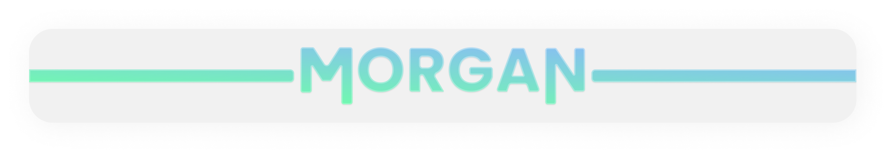

<h1 align="center">Hello there! 👋</h1>

  
  
  
  

Glad you're here 🤗

  

<h2 align="center">A Few Things About Me:</h2>

<ul align="center" >
  <li>I'm Welsh 🐲</li>
  <li>I don't speak Welsh 🤨</li>
  <li>I'm a developer 🤓 (Well, I try...)</li>
  <li>I like to design 🖌️ (Is it good? Don't ask that again.)</li>
  <li>I'm learning Spanish! 🇪🇸 (and a bit of Welsh)</li>
</ul>

<h2 align="center">Experience</h2>
<table align="center">
  <tr>
    <th>Language</th>
    <th>Experience</th>
  </tr>
  <tr>
    <th>Java/TypeScript</th>
    <th>Pretty good</th>
  </tr>
  <tr>
    <th>Sveltekit</th>
    <th>Also pretty good</th>
  </tr>
  <tr>
    <th>Bash</th>
    <th>As much as I hate it I'm not that bad</th>
  </tr>
  <tr>
    <th>Rust</th>
    <th>Uh, great language I just don't know much about it so far.</th>
  </tr>
  <tr>
    <th>Markdown</th>
    <th>I AM A GOD AT MARKDOWN (except it's not a programming language (and this whole file isn't even technically markdown it's just a lot of HTML))</th>
  </tr>
</table>

(If the table above didn't make you realize I'm not currently looking to be hired (because of how unspecific the values were) then woah)

<!--
### My Favourite Projects
- [Database of Things](https://github.com/MorganWJones/database-of-things)
- [RubyCommands](https://github.com/MorganWJones/rubycommands)
- [My Dotfiles](https://github.com/MorganWJones/dotfiles) and [mscripts](https://github.com/MorganWJones/mscripts)
- [My Website](https://morganuk.ga) ([repo](https://github.com/MorganWJones/morganuk.ga))

### My Current Setup
- Arch Linux
- NeoVim
- Git

### Experience:
- [Type|Java]Script
	- Discord.js
	- Express.js
- Sveltekit
- (S)CSS
- A little bit of raw HTML
- Figma my beloved 🥰

### Things I am Learning/Would Like to Learn
- Rust
- Dart & Flutter
-->
